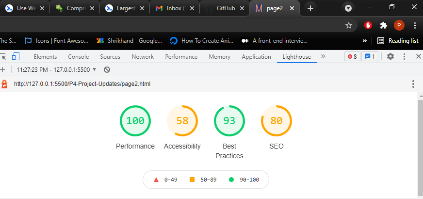

<html lang="en">
<head></head>
<body>
<h1>GoMike Designs</h1>
<h2>Project Brief</h2>

Mike is a freelance website designer based in Atlanta and wants to optimize his website to gain more clients for his business

<h2>Before Search Engine Optimization</h2>
</img>
</img>
<h2>After Search Engine Optimization</h2>
</img>
</img>

<h2>Optimization(s) on Website</h2>
<ul>
<li>
optimized images on the site to resolve crawbility issues and reduce loading time
</li>
<li>
Added pre-load keys to proritize fetching resources on the page
</li>
<li>
Removed unused HTML tags on both pages
</li>
<li>
Changed the all text which were represented as images on the webpage
</li>
<li>
Included page language in header
</li>
<li>
Applied the appropriate contrast for text as against their background
</li>
<li>
Added Aria-Labels for Assistive Technologies and inclusiveness for users of the webpage/p></li>
<li>
Images were provided alt tags
</li>
<li>
Minify files for faster loading time
</li>
<li>
Implemented proper heading (h1, h2, h3) page structure
</li>
<li>
Removed the keywords contained in the Meta-tag recognised as Blackhat tactics
</li>
<li>
Added a title to both pages for best SEO practices
</li>
</ul>
